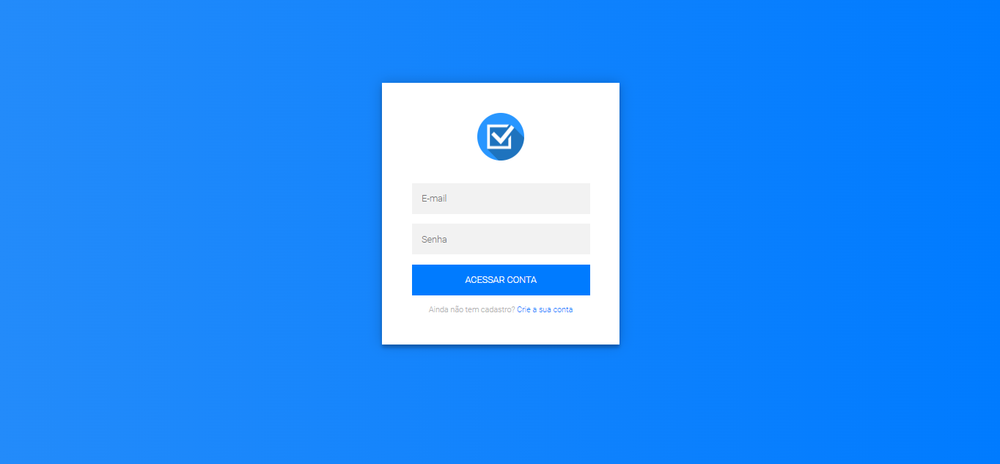
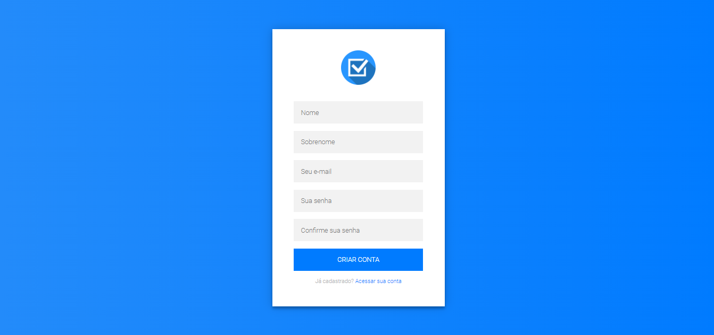
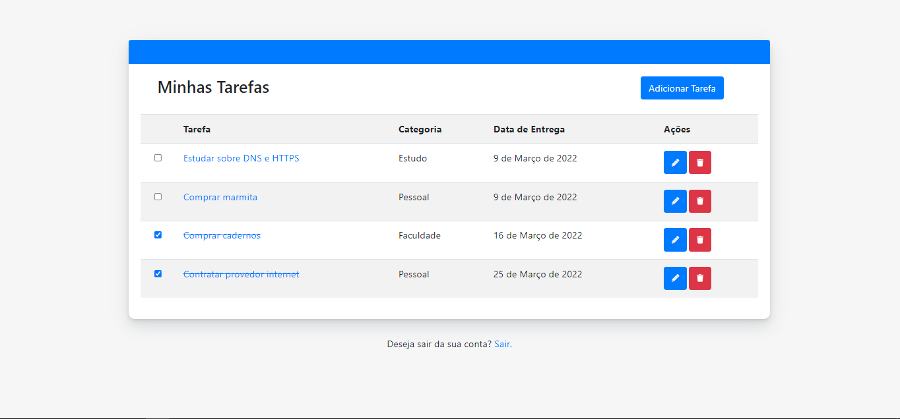
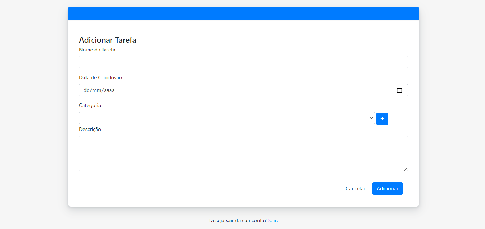
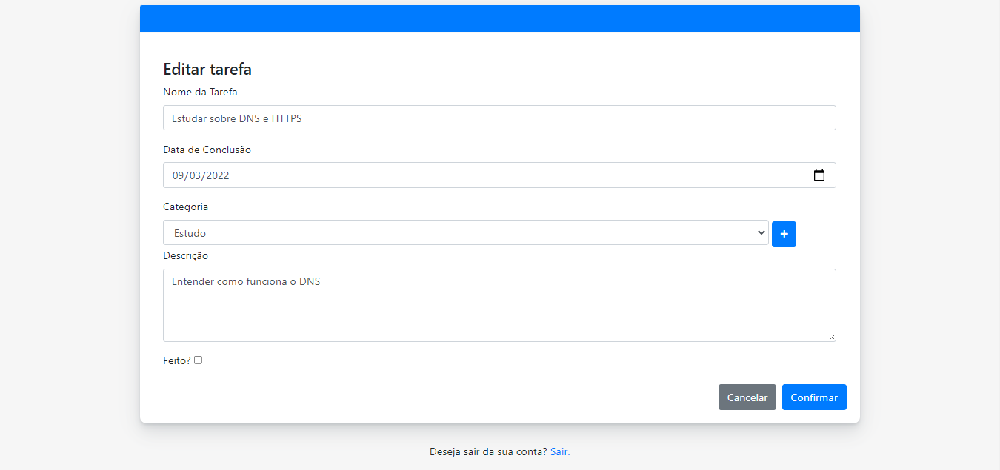
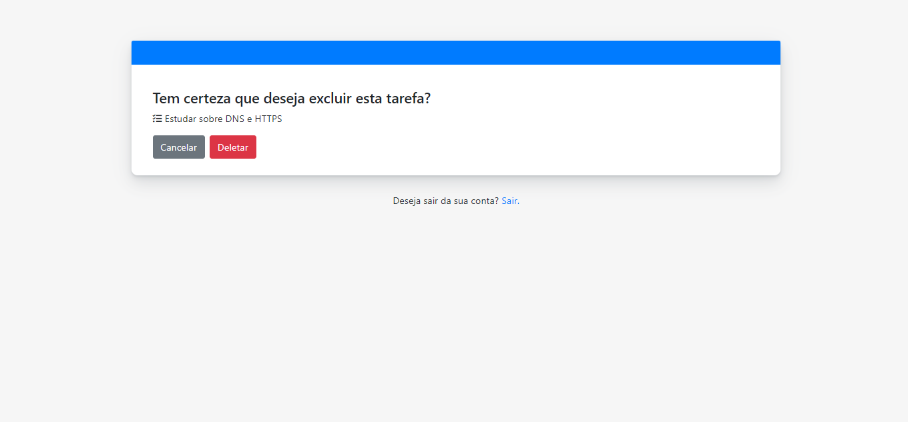

<div align="center" id="top"> 
  

  &#xa0;

  <!-- <a href="https://smartagênciadeempregos.netlify.com">Demo</a> -->
</div>


<h1 align="center">To-do list</h1>


<!-- Status -->

<h4 align="center"> 
	🌐 Projeto Concluído 🌐
</h4> 

<hr>

<p align="center">
  <a href="#dart-sobre">Sobre</a> &#xa0; | &#xa0; 
  <a href="#sparkles-funcionalidades">Funcionalidades</a> &#xa0; | &#xa0;
  <a href="#rocket-tecnologias">Tecnologias</a> &#xa0; | &#xa0;
  <a href="#white_check_mark-pré-requisitos">Pré requisitos</a> &#xa0; | &#xa0;
  <a href="#checkered_flag-começando">Começando</a> &#xa0; | &#xa0;
  <a href="#memo-licença">Licença</a> &#xa0; | &#xa0;
  <a href="https://github.com/gustaoliv" target="_blank">Autor</a>
</p>

<br>

## :dart: Sobre ##

Projeto desenvolvido para aplicação de conhecimentos adquiridos em cursos de Django. Aplicação com utilização prática para organização de tarefas do dia a dia.

<div align="center"> 
  
  &#xa0;
</div>

<div align="center"> 
  
  &#xa0;
</div>

<div align="center"> 
  
  &#xa0;
</div>

<div align="center"> 
  
  &#xa0;
</div>

<div align="center"> 
  
  &#xa0;
</div>

<div align="center"> 
  
  &#xa0;
</div>

## :sparkles: Funcionalidades ##

:heavy_check_mark: Cadastro de tarefas pelo front;\
:heavy_check_mark: Listagem de tarefas;\
:heavy_check_mark: PopUp detalhes da tarefa;\
:heavy_check_mark: Tela de login e cadastro;\
:heavy_check_mark: Funcionalidade de editar e deletar tarefas;\
:heavy_check_mark: Mudar status da tarefa ao clicar no checkbox;\


## :rocket: Tecnologias ##

As seguintes ferramentas foram usadas na construção do projeto:

- [Django](https://www.djangoproject.com/)
- [Bootstrap](https://getbootstrap.com/)

## :white_check_mark: Pré requisitos ##

Antes de começar :checkered_flag:, você precisa ter o [Django](https://www.djangoproject.com/) e o [Virtualenv](https://virtualenv.pypa.io/en/latest/#) instalados em sua maquina.

## :checkered_flag: Começando ##

```bash
# Clone este repositório
$ git clone https://github.com/gustaoliv/Django-To-do-List.git

# Entre na pasta
$ cd Django-To-do-List

# Criação da Virtualenv
$ virtualenv venv

# Ativação da Virtualenv
$ /venv/Scripts/activate

# Instalação das dependências
$ pip install -r requirements.txt

# Crie um arquivo .env no diretório do projeto, com o conteúdo:
SECRET_KEY=COLOQUE AQUI A SUA CHAVE DE SEGURANÇA
DEBUG=True

# Iniciando aplicação
$ python manage.py runserver

# O site vai inicializar em <http://localhost:8000>
```

## :memo: Licença ##

Feito com :heart: por <a href="https://github.com/gustaoliv" target="_blank">Gustavo Oliveira</a>

&#xa0;

<a href="#top">Voltar para o topo</a>
